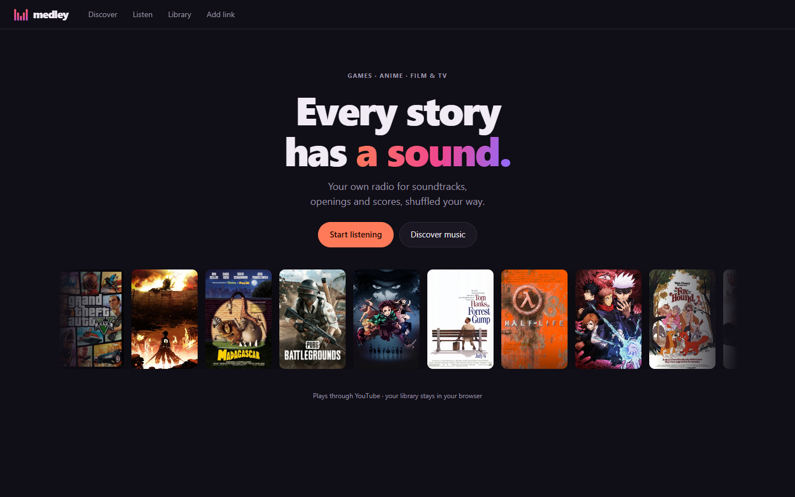
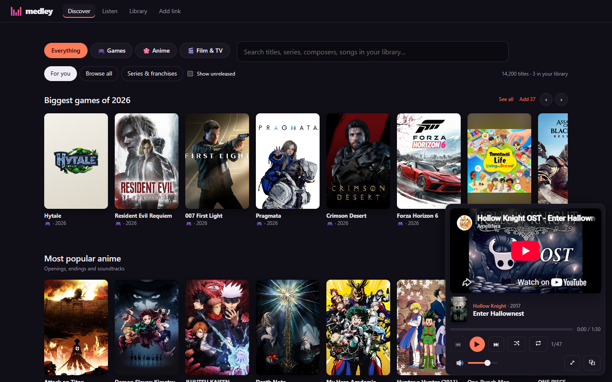
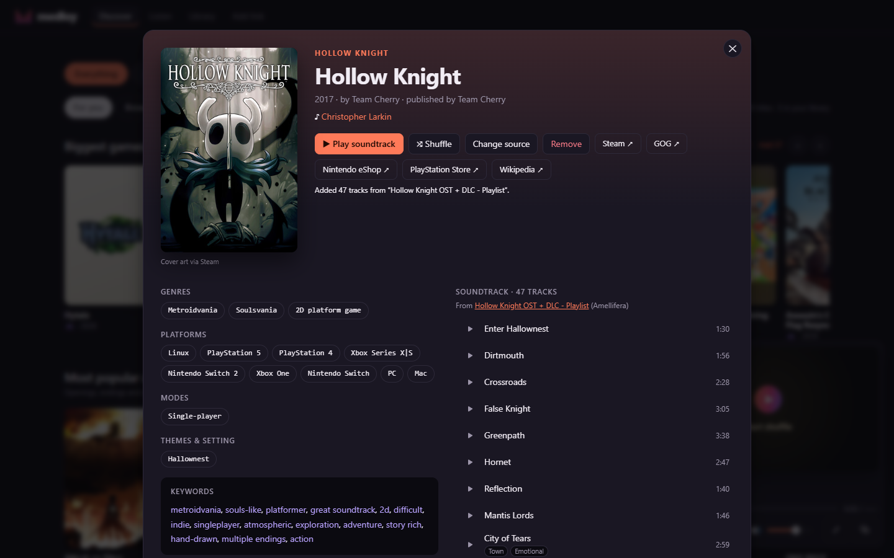
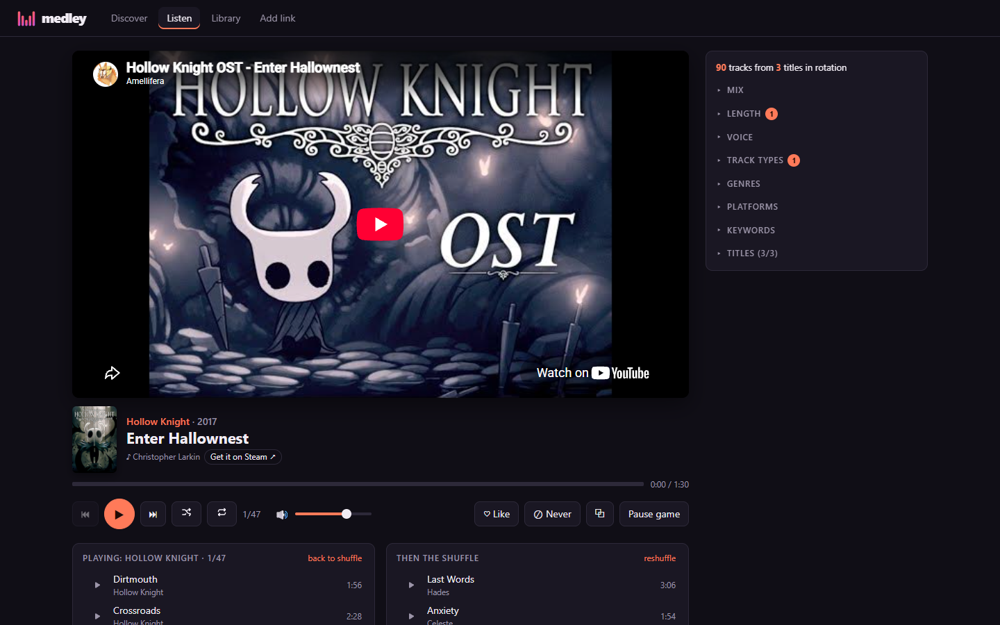

<p align="center">
  
</p>

<h1 align="center">Medley</h1>

<p align="center">
  <b>Every story has a sound. Medley plays yours.</b><br>
  A personal radio for game soundtracks, anime openings and film &amp; TV scores.
</p>

<p align="center">
  <a href="LICENSE"></a>
  
  
</p>

---

You know the feeling. The first bars of a boss theme and your hands remember the fight. An anime
opening comes on and you're singing along in a language you don't speak. A film score swells and
you're right back in the cinema.

**Medley is a radio made of exactly that music, and nothing else.** Tell it which games, shows
and films you love; it finds their music, keeps it organised, and shuffles it the way *you* like.
No algorithm guessing what you might want next, no autoplay detours, no account.

## Three worlds of music

| | What's in the catalog | What one click brings in |
|---|---|---|
| 🎮 **Games** | ~9,100 games, from NES classics to this year's releases | The whole soundtrack in album order. Different music on the GBA version? You get both. |
| 🌸 **Anime** | The 1,200 most popular anime | Every opening, ending and insert song, by name and artist, plus the score |
| 🎬 **Film & TV** | ~3,900 films and series | The score, plus the songs, so Disney sing-alongs are a filter away |

## A look around

<table>
  <tr>
    <td width="50%"></td>
    <td width="50%"></td>
  </tr>
  <tr>
    <td><b>Discover</b> new favourites: shelves per world, every series, and this year's biggest releases.</td>
    <td><b>Every title has a page</b>: its soundtrack in order, who composed it, and where to play it.</td>
  </tr>
  <tr>
    <td colspan="2"></td>
  </tr>
  <tr>
    <td colspan="2"><b>Listen</b> your way: a soundtrack front to back, or a shuffle you steer yourself.</td>
  </tr>
</table>

## Why it's fun

**🎛️ A shuffle you're in charge of.** Want only openings? Only songs you can sing along to?
Nothing from before 2000, nothing longer than six minutes, nothing but metroidvanias? Flip a
chip. Two sliders do the rest: *Variety* (stick with one title for a while, or never play two in
a row) and *Familiarity* (dig up tracks you've never heard, or lean on your favourites).

**💿 Albums when you want them.** Press ▶ on any title and its soundtrack plays front to back,
with a track counter, shuffle and loop. When it ends, the radio carries on.

**🌸 Anime, done properly.** Openings are labelled OP1, OP2…, endings ED1, ED2…, with the
artist. Medley picks the original over live performances and covers. Only here for the
openings? Import just those, or paste a whole list of shows and get every opening at once.

**🌱 It grows by itself.** Every week Medley checks for new releases, new episodes' songs and
updated playlists, and tells you what's new. Follow a collection (say, *Nintendo Switch 2* or
*Studio Ghibli*) and new titles arrive on their own.

**♥ It learns what you like, gently.** Like a track and it comes up more. Skip one early and it
comes up a little less. Never want to hear something again? ⊘, and it's gone.

**🎧 It's there when you need it.** Your keyboard's media keys work. So do your headphones'
buttons. Pop the player out into a tiny always-on-top window while you work (Chrome and Edge).
Install it as an app. It works on your phone too.

**🔒 It's yours.** Your library, likes and history live in your own browser. Nothing is
uploaded and nobody is watching. Back it up with one click whenever you like.

## Get started

**Just curious?** [Try the preview in your browser](https://buildthomas.github.io/medley/): browse
everything and play a demo library. It can't add music (that needs Medley's own little server),
but whatever you like and play there moves with you when you install it.


You'll need [Node.js](https://nodejs.org) (version 22.18 or newer). Then:

```bash
git clone https://github.com/buildthomas/medley.git
cd medley
npm install
npm run dev
```

Open **[localhost:32123](http://localhost:32123)** (the logo's bar heights: 3-2-1-2-3), head to
**Discover**, add a handful of titles you love, and press play. That's it: no keys, no sign-up,
no setup.

Some good to knows:

- **Phones:** everything works at phone size. The music pauses when your phone locks or you
  switch apps (YouTube does that to every embedded player; background play is a YouTube Premium
  feature) and picks up again when you come back.
- **Keys:** <kbd>Space</kbd> play/pause · <kbd>N</kbd> skip · <kbd>P</kbd> back ·
  <kbd>L</kbd> like · <kbd>B</kbd> never play · <kbd>↑</kbd>/<kbd>↓</kbd> volume · <kbd>M</kbd> mute
- **Reloading** is safe: you land back on the same track, at the same spot.

## Share it with friends

Medley can run on a small server for a few friends, invite-only, with everyone keeping their
own library. [docs/hosting.md](docs/hosting.md) walks you through it.

## Where the music comes from

All music plays through YouTube's official embedded player: Medley finds the playlists, it
doesn't copy, host or download anything. The facts about each title (composers, release dates,
covers, songs) come from open data: [Wikidata](https://www.wikidata.org),
[Wikipedia](https://www.wikipedia.org), [AniList](https://anilist.co) and
[AnimeThemes](https://animethemes.moe). Thank you to everyone who keeps those up to date.

## For developers and AI agents

Curious how it works, or want to help? Start at **[AGENTS.md](AGENTS.md)**: a two-minute
orientation written for people and AI coding agents alike. Everything technical (architecture,
catalogs, the shuffle algorithm, YouTube import, hosting) lives in **[docs/](docs/README.md)**.

## License

Medley is free to use, share and adapt for **non-commercial** purposes, with credit, under
[CC BY-NC-SA 4.0](LICENSE); changed versions keep the same license. The catalog data keeps its
sources' terms (Wikidata is CC0; AniList and AnimeThemes data is for non-commercial use).
